# 02 — Architecture

Status: design draft for review (2026-09-17). Decisions are recorded in ADR 0002–0011 (`docs/adr/`). Interfaces are in `03-interfaces.md`; models in `04-models.md`.

## Executive summary (five-minute read)

**What this is.** A headless, deterministic V2X world simulator with an attachable 2D/3D UI, designed as a research instrument: every model is explainable and cited, every layer is a plug-in, and every run reproduces byte for byte from a scenario file plus a seed.

**What changes from today.** The current repository is a 10k-line pure-Python dataset generator whose science (butterfly keys, linkage values, 12-detector suite, 25-attack catalog, MA dataset schema, leakage linter, foundry) is sound but whose engine is one 1,600-line function with no channel model, no node hardware, no lane-level roads, no 3D, and Windows-only tooling. ADR 0002 supersedes ADR 0001's base-stack decision: the new system is a **new core**, not an evolution, and the existing code becomes (a) a validated reference frozen under `legacy/` and (b) a set of ported libraries whose test vectors must still pass (inventory and dispositions in `01-inventory.md`).

**The core is Rust** (ADR 0003): a discrete-event kernel with nanosecond ticks drives a fixed-step mobility integrator, a frame-level radio model, byte-accurate message and security encoders, node runtimes with CPU/HSM queues, and pluggable credential-management protocols. Python bindings make Python the language for researcher plug-ins (protocol logic, detectors, attackers, metrics, exporters) through batched calls, and a WebAssembly build runs small scenarios and the replay reader in the browser. The choice is driven by cross-platform float determinism, throughput at 10,000 nodes (spike evidence in §11), a browser story, and an Apache-compatible ecosystem.

**Time** (ADR 0004): one logical clock; network, backend, and node compute are discrete events; mobility advances in fixed steps scheduled as events. Determinism does not depend on thread count because every random draw comes from a counter-based stream keyed by (seed, domain, entity), and parallel phases are pure maps whose outputs are merged in id order.

**Fidelity ladder.** Every model family has `abstract | medium | high` tiers behind one interface with a documented list of what each tier ignores. Mixed radio tiers are allowed with an explicit coupling rule (§7.3) and a stated bias.

**Mobility** (ADR 0005): native lane-level engine (IDM/MOBIL/gap acceptance/signals) plus optional SUMO co-simulation out of process. **Network** (ADR 0006): native 802.11p, LTE-V2X and NR-V2X PHY/MAC validated against published curves; ns-3 only as an optional external cross-check. **Plug-ins** (ADR 0007): Rust traits, batched Python, or gRPC; model cards mandatory. **Recording** (ADR 0008): MCAP with two channel encodings — snapshot channels holding the VWP wire bytes verbatim, event/telemetry/metric channels holding serde records — plus Parquet tables; one WebSocket protocol for live and replay. **UI** (ADR 0009): a single Three.js scene for 2D and 3D so "click a car and fly down into it" is a camera move over one world model; React app; uPlot and Plotly. **Repo** (ADR 0010): monorepo with `just setup` on macOS, Linux, Windows.

**Backward compatibility.** The MA dataset family (`ma/*`, `ground_truth/*`, `ml/*`, manifest, datasheet) is preserved by porting the `datagen` package as one exporter (schema v2 = v1 plus additive columns, with a `--legacy-v1` profile), see `08-measurement-and-data.md` §6.

**Phase 1** (in `10-roadmap.md`) is a vertical slice: one vehicle on a real-city map with buildings, native mobility, one radio tier, real 1609.2-style signed BSMs at 10 Hz, one hardware profile with the live OBU HUD in 2D and 3D, a recorded run replayed, and one metric plotted.

## 1. Goals and non-goals

Goals are the eight user capabilities and nine principles in the brief (`00-design-brief.md` §1–2). Non-goals for the first three phases: photorealistic rendering; physics-based vehicle dynamics (tyre models); modeling of in-vehicle buses (CAN) beyond an abstract application-processing cost; a general-purpose network simulator (only the V2X-relevant stacks are modeled); replacing SUMO for large-scale traffic assignment studies.

## 2. System overview

```mermaid
flowchart LR
  subgraph Inputs
    SC[Scenario file<br/>YAML/JSON, schema v1]
    WS[World sources<br/>OSM · SUMO net · procedural · JSON · editor]
    HP[Hardware profiles<br/>data files with citations]
    PL[Plug-in registry<br/>model cards]
  end
  subgraph Engine["Engine (Rust, headless)"]
    K[DES kernel<br/>ns clock · event heap · RNG streams]
    W[World model<br/>lanes · buildings · terrain · signals]
    M[Mobility<br/>native | SUMO]
    R[Radio<br/>propagation · PHY · MAC · DCC]
    N[Net & infra<br/>WSMP/GN · frag · Uu · backhaul · backend net]
    MS[Messages & security<br/>ASN.1 UPER · 1609.2/103097 · crypto real|modeled]
    ND[Node runtimes<br/>OBU · RSU · BS · backend<br/>queues · CPU/HSM · stores]
    PR[Protocol host<br/>SCMS · ETSI · threshold/PQ]
    TH[Threats & detection<br/>attackers · detectors · MA · responder]
    MT[Metrics]
    REC[Recorder<br/>MCAP · keyframes]
    EXP[Exporters<br/>MA dataset · receiver logs · telemetry · traces]
    SRV[Server<br/>JSON-RPC control · VWP WebSocket]
  end
  subgraph Clients
    CLI[CLI v2xw]
    PY[Python API / notebooks / copilot]
    UI[Studio UI<br/>Three.js 2D+3D · HUD · inspector · plots]
    RP[Replay reader<br/>native or WASM]
  end
  SC --> K
  WS --> W
  HP --> ND
  PL --> K
  K --> M --> W
  K --> R --> N --> MS --> ND --> PR
  ND --> TH --> MT
  K --> REC
  MT --> EXP
  REC --> EXP
  K --> SRV
  REC --> RP --> SRV
  SRV <--> CLI
  SRV <--> PY
  SRV <--> UI
```

Component responsibilities (crate names per ADR 0010):

| Component | Crate | Owns | Never touches |
|---|---|---|---|
| DES kernel | `v2xw-core` | clock, event heap, RNG streams, registry, manifest, provenance ids | model equations |
| World | `v2xw-world` | one geometry model, importers, provenance, spatial indices for static geometry | actors |
| Mobility | `v2xw-mobility`, `-sumo` | ground-truth kinematics, demand, signals state | radio, security |
| Radio | `v2xw-radio` | propagation, fading, obstacle shadowing, PHY, MAC, DCC, channel accounting | message semantics |
| Net & infra | `v2xw-net` | WSMP/GN/BTP headers, fragmentation, backhaul, cellular Uu, backend links | crypto |
| Messages & security | `v2xw-msg`, `v2xw-sec` | ASN.1 encoders, envelopes, primitive descriptors, crypto backends, cost tables | node scheduling |
| Node runtime | `v2xw-node` | queues, servers (CPU/HSM), stores, clock, position estimate, telemetry | GT kinematics (receives only what GNSS model gives) |
| Protocol host | `v2xw-proto` (+ Python) | entity state machines, flows, revocation, reporting formats | radio |
| Threats & detection | `v2xw-threat` (+ Python) | attacker host, jammers, perception hook, detector host, MA host | GT (attackers) |
| Metrics, recorder, exporters | `v2xw-metrics`, `v2xw-record` | metric providers, MCAP, Parquet, dataset exporters, leakage linter | engine state mutation |
| Server, CLI, bindings | `v2xw-server`, `-cli`, `-py`, `-wasm` | control surface, streaming, packaging | model logic |

## 3. Data flow

```mermaid
sequenceDiagram
  participant U as User/CLI/API
  participant S as Server
  participant K as Kernel
  participant P as Plug-ins
  participant REC as Recorder
  participant UI as Studio UI
  U->>S: run(scenario.yaml, seed)
  S->>K: load + validate (schema, registry, tiers, licences)
  K->>K: build world (cached by content hash)
  K->>P: instantiate models, resolve params, collect model cards
  K->>REC: write manifest, world hash, cards
  loop each event
    K->>P: dispatch (mobility step | frame | verify | flow message | timer)
    P-->>K: actions, records, provenance
    K->>REC: typed records; keyframe every K s
    K-->>S: VWP deltas (if attached)
    S-->>UI: binary frames
  end
  K->>REC: finish (index, digests)
  K->>P: exporters.close() → files + digests
  S-->>U: run id, manifest, paths
```

Everything the UI shows comes from the same typed records the recorder writes; there is no side channel. The replay reader produces the identical VWP stream from the MCAP file, which is why the UI cannot tell live from replay.

## 4. World model

One lane-level model (`v2xw-world`), imported from OSM, SUMO `.net.xml`, procedural generators, the legacy JSON node/edge format, or the editor. The canonical internal format is **our own** (documented as `world-1`: a versioned, sectioned little-endian container in which a reader skips any section kind it does not know, plus a JSON form for debugging), with lossless import from SUMO net.xml and OpenDRIVE via SUMO's `netconvert` when SUMO is installed, and a native OSM importer (osm2streets-style lane inference) when it is not. Rationale and alternatives (SUMO net.xml, OpenDRIVE, Lanelet2 as canonical) are in `04-models.md` §1.1; the short version: no external format carries buildings, terrain, propagation environment classes, provenance, and render hints together, and we need one object for propagation and rendering.

Geometry is stored once and consumed three ways: mobility (lane centrelines, connections, conflicts), propagation (building footprints/heights, terrain DEM, vehicle boxes), rendering (extruded footprints with LOD, lane markings, signals). Static spatial indices: an R-tree over building footprints, a grid over lanes, a DEM raster. Provenance (`WorldProvenance`) records source, bbox, import date, tool versions, transformations and licence (OSM ODbL obligations for exported worlds and datasets are handled in `08-measurement-and-data.md` §9).

## 5. Time model (ADR 0004)

### 5.1 Clock and events

- `SimTime` is `u64` nanoseconds since `t0`. Models see 1 µs resolution guaranteed; the extra precision lets frame boundaries (8 µs symbols, 13 µs slots) and propagation delays (1 µs per 300 m) be represented exactly without float accumulation.
- One binary heap of `(time, priority, seq)`. Priorities are fixed per event class so ordering at equal times is a documented rule, not an accident:

| Priority | Event class | Why this order |
|---|---|---|
| 0 | `Control` (scenario events: parameter change, outage, closure) | must be visible to everything else at the same instant |
| 1 | `MobilityStep` | kinematics for time *t* are final before any radio event at *t* reads them |
| 2 | `SignalPhase` | intersection state before vehicles decide |
| 3 | `PhyEnd` (end of frame arrival → reception outcome) | reception decided before MAC reacts |
| 4 | `MacTimer` (backoff, AIFS, SPS reservation) | |
| 5 | `PhyStart` (a transmission begins) | after MAC decisions at the same instant |
| 6 | `NodeTask` (verify done, app timer, generator tick) | |
| 7 | `NetDeliver` (backhaul/cellular/backend delivery) | |
| 8 | `FlowTimer` (protocol timers, batch windows) | |
| 9 | `Metric` / `Keyframe` / `Export` | observe a fully settled instant |

- `seq` is a global monotonic counter assigned at `schedule()`. Two events with equal time and priority run in the order scheduled; because scheduling happens in a deterministic order (id-sorted merges, §6.4), the run is deterministic.
- **The dispatch sequence is non-decreasing in `(time, priority, seq)`.** A handler running at instant *t* may schedule at *t*, but not at an *earlier priority* than the one being dispatched — otherwise the injected event runs next, the key sequence goes backwards, and the two guarantees the table exists to provide (`Control` visible to everything else at the instant, `Observe` seeing a settled instant) are void for that instant. The kernel asserts this in debug builds. The rare handler that genuinely needs a zero-delay, earlier-priority injection says so with `Scheduler::schedule_reentrant`, which is exempt from the check and documents that consumers batching the dispatch stream by key must tolerate it.
- Cancellation is lazy and the heap is compacted when dead entries outnumber live ones, so a 24-hour run that reschedules a timer every tick (§5.4) keeps a heap proportional to its live event set rather than to its length.

### 5.2 Fixed-step mobility inside the DES

Mobility is a periodic `MobilityStep` event with period `Δt_mob` (default 100 ms, allowed 10–100 ms; SUMO tier ≥ 10 ms). At each step the mobility provider integrates all actors and publishes `Kinematics` with timestamp *t*. Between steps, any consumer needing a position at time *t′* ∈ (t, t+Δt) uses the **published extrapolation rule**: `pos(t′) = pos(t) + vel(t)·(t′−t)` (constant velocity), so frame-level radio events see continuous, deterministic positions. This rule is part of the interface contract (03-interfaces §3, I-M4), and a model card lists it as an assumption. Spatial indices are rebuilt at each mobility step, and the grid cell size equals the maximum modeled communication range (default 1,000 m for 802.11p high tier), so a neighbor query touches at most nine cells.

### 5.3 Generation, transmission, reception timeline

```mermaid
gantt
  dateFormat  x
  axisFormat  %L ms
  section OBU A
  BSM generator tick (10 Hz)      :a1, 0, 1
  sign (HSM queue, cost table)    :a2, 1, 3
  MAC enqueue, AIFS+backoff       :a3, 3, 5
  PHY tx (air time by MCS/bytes)  :a4, 5, 7
  section OBU B
  arrival start (+propagation)    :b1, 5, 7
  SINR accumulation over overlap  :b2, 5, 7
  finish_rx → outcome             :b3, 7, 8
  verify queue (policy)           :b4, 8, 10
  app / detectors / neighbor table:b5, 10, 11
```



### 5.4 Multi-rate and long horizons

Backend flows (weekly CRLs, top-ups) run for days of simulated time while radio events need microseconds. The engine supports **time dilation windows**: a scenario may declare periods where only the backend and mobility-abstract tiers run (no radio events), letting a 24-hour certificate-lifecycle experiment run in minutes. The manifest records the windows; metrics that depend on radio events are marked `not-observed` inside them. This is the only mechanism by which two tiers change over time, and it is explicit in the scenario.

## 6. Determinism model

### 6.1 Contract

Same scenario file + seed + engine build + plug-in set ⇒ byte-identical MCAP records (excluding the timestamped manifest header), identical exporter outputs, identical digests, on macOS/Linux/Windows, x86-64/arm64, native or WASM, single- or multi-threaded. Golden tests in CI enforce this across the three OSes for the Phase 1 and Phase 2 scenarios.

### 6.2 Random numbers

- No shared sequential RNG. A `RngStream` is a ChaCha12 keystream keyed by `H(master_seed ∥ domain ∥ entity_id)` with a 64-bit counter; the key derivation is SHA-256, the stream algorithm is implemented in-crate (no platform dependency).
- Domains are an enum (`Spawn, Mobility, LaneChange, Gnss, Shadow, Fading, MacBackoff, SpsSelection, AbstractRx, Attack, ServiceTime, Backend, Collusion, Perception, …`) and `entity_id` is the acting entity (actor, node, link, or `(link, frame)`), so the draw sequence of one entity never depends on another entity's activity. This is the generalisation of the legacy `f"{seed}:sensor:{vid}"` scheme (01-inventory §3) that also removes its order dependence.
- **One domain names one purpose.** Order-independence is a property of a `(domain, entity)` key, not of an entity: two models drawing from one key interleave, and each then depends on which ran first. Splitting a purpose into its own domain costs nothing (a new code perturbs no existing stream), which is why desired-speed and reaction-time sampling are domains of their own rather than sharing `Mobility`. An out-of-tree plug-in's domain code and custom entity scope are **derived from its model-card id**, not picked by hand, so two independently written plug-ins cannot collide on a number both authors liked.
- The registry accessor takes `&self` and hands out a guard (`RngRegistry::checkout`, `Ctx::rng`), because the draws happen inside the phase-parallel maps of §6.4; a second task asking for a key that is already checked out panics rather than silently receiving a stream restarted at word 0. Keys whose scope already embeds a counter — `(link, frame)` — are derived and dropped rather than cached, so the stream cache is bounded by the number of live entities, not by the number of frames the run carries.
- Distribution samplers (normal via Box–Muller with fixed branch, exponential, Nakagami via gamma, log-normal) are implemented once in `v2xw-core` using integer-to-float conversion `u64 >> 11` × 2⁻⁵³, never platform `libm`.

### 6.3 Floating point

- Rust `f64` with `-C target-feature` unchanged (no `fast-math`; Rust never contracts `a*b+c` into FMA unless `mul_add` is called explicitly, so results are bit-identical across x86-64 and arm64).
- Transcendentals (`sin, cos, atan2, exp, log, pow, sqrt` except `sqrt` which is IEEE-exact) go through the `libm` crate (pure-Rust ports of musl) so macOS, Linux, Windows and WASM agree bit for bit. The conformance kit greps plug-in crates for `f64::sin`-style std calls and fails them.
- Summation order in reductions (SINR interference sums, metric aggregation) is fixed by sorting contributors by id before summing.
- **Every float leaving the engine is quantised first** (ADR 0004 decision 7, build decision D9). `v2xw-core`'s `math::quantize_to(x, quantum)` is the single writer-side encoder every crate calls; `math::quantize(x, decimals)` is the same function spelled in decimal places and `math::is_on_grid` is the predicate the output-scanning test asserts. The rounding is `(x·(1/q)).round()/(1/q)`: **ties away from zero**, built only from `*`, `/` and `round`, all IEEE-exact, so it is bit-identical on every target. It rounds the scaled binary value rather than the exact decimal expansion, so a near-tie can differ by one quantum from Python's `round(x, n)` (`2.675` at `1e-2` gives 2.68, Python gives 2.67) — which D9 §2–3 already allows, having retired digest equality with the legacy corpus and set cross-engine float comparison at `1e-9`.
- Python plug-ins receive and return values through typed Arrow buffers; the engine applies the same rules, and Python code that uses NumPy transcendental functions is documented as "deterministic per platform only" and marked in the manifest (`python-hot-path`).

### 6.4 Deterministic parallelism

Parallelism is **phase-parallel**, never event-parallel:

- Mobility step: actors partitioned; each partition writes a new `Kinematics` buffer from the previous-step snapshot (Jacobi update); merged in `ActorId` order. Interaction terms (leader lookup) read the snapshot only.
- Reception: at each `PhyEnd`, outcomes for all receivers of that frame are independent given the arrival set (I-R2); computed with `rayon` and merged in `NodeId` order. Interference sums iterate over id-sorted transmitter lists.
- Verification cost accounting per node, detectors per node, metrics flush: independent per node, merged by id.
- The event loop itself is single-threaded; parallel phases are pure maps. Thread count only changes wall time.

### 6.5 Provenance

Manifest fields: scenario hash (canonical JSON), master seed, engine version + git commit + build hash, platform triple, plug-in list with semver and content hash, model card versions, world content hash, SUMO version if used, crypto mode, time-dilation windows, per-file SHA-256 and an aggregate digest (kept from the legacy `_data_digest`). The `why` service (03-interfaces §1.1) records, for each displayed or exported value, the `ModelRef` and parameter-set id that produced it; parameter sets are content-addressed so the inspector can show "this shadowing value came from `radio/propagation/log-distance-shadowing@1.2.0` with σ = 4 dB (source: …)".

## 7. Fidelity ladder

### 7.1 Tiers per family (what each tier ignores)

| Family | abstract | medium | high |
|---|---|---|---|
| Mobility | kinematic along lanes at desired speed; no interaction; ignores queues, signals, lane changes | native IDM + MOBIL + gap acceptance + signals + weather; ignores tyre dynamics, driver heterogeneity beyond parameter draws | SUMO co-sim (Krauss/IDM/Wiedemann, LC2013, junction model, pedestrians) |
| Propagation | distance-only preset curve calibrated to the high tier; ignores geometry | log-distance + log-normal shadowing per env + building/vehicle obstacle shadowing; ignores fast fading | + Nakagami-m fast fading, terrain diffraction, antenna patterns, weather attenuation |
| PHY | reception = calibrated probability(distance, local load); ignores SINR | SINR with aggregate interference from concurrent transmitters and PER curves per MCS; ignores capture timing and preamble details | + preamble detection, capture, symbol-overlap SINR windows, half-duplex, in-band emissions (C-V2X) |
| MAC | none (load feeds the abstract PHY) | slotted abstraction: CSMA contention resolved per slot with collision probability; SPS reservations without sensing details | full EDCA state machine with AIFS/CW/backoff and hidden terminals; full sensing-based SPS with RSRP thresholds and reselection |
| Net/frag | header sizes only | + reassembly with loss amplification | + per-fragment timers, P2PCD, GN forwarding |
| Compute | infinite CPU, sizes counted | one CPU server + HSM server, FIFO, cost tables | multi-core PS, memory, storage growth, priority queues, thermal off |
| Backend | fixed latency per link and entity | M/M/c per entity + batching | measured service-time distributions, availability, retries |
| Crypto | modeled (cost tables) | — | real primitives (identical outcomes, I-S1) |
| Perception | none | disc sensor with range and FOV, detection probability by range | + occlusion by buildings/vehicles, per-sensor error models |

### 7.2 Choosing tiers

The scenario selects tiers per family; the validator enforces consistency rules from the registry (e.g., `phy: high` requires `mac: high`; `propagation: abstract` forbids `phy: high`), and the manifest records the resolved tier matrix.

### 7.3 Mixed radio tiers (focus region)

The brief asks whether mixing "full PHY around the followed vehicle, abstract elsewhere" can be made sound. Answer: **sound with a stated bias, under these rules.**

- A *focus region* F (circle around a followed node or a bbox) is high-tier; the complement is abstract or medium.
- Transmissions originating outside F but within `range_max` of F still create arrivals inside F: their receive power at F-receivers is computed with the medium-tier propagation model (deterministic), so interference inside F is complete. Transmissions inside F are received outside F by the abstract rule. Thus the high-tier region sees every interferer and is exact; the abstract region sees a calibrated approximation.
- Bias: nodes just outside F receive frames from inside F by the abstract rule, whose parameters were calibrated on homogeneous conditions. The validation suite measures the PDR discontinuity at the boundary (target ≤ 5 percentage points at the calibrated density, `04-models` §4.9) and the UI draws the boundary. Metrics are tagged by tier so cross-region aggregates are never mixed silently.
- When it cannot be sound: CSMA back-off state of nodes outside F is not modeled, so hidden-terminal effects that originate outside F are under-represented inside F. Experiments whose object of study is MAC-level contention must run homogeneous `high`; the validator warns when `mac: high` is combined with a focus region and the metric set includes MAC metrics.

## 8. Plug-in system (ADR 0007)

Three mechanisms, one registry:

| Mechanism | Language | Granularity | Use |
|---|---|---|---|
| In-process trait object | Rust | per event | hot paths: propagation, PHY, MAC, car-following, codecs, crypto |
| In-process PyO3 with batching | Python | per node-step or per flow message, Arrow batches | protocols, detectors, attackers, MA, metrics, exporters, generators, demand, importers |
| Out-of-process gRPC | any | per batch | SUMO adapter (TraCI inside the engine), ns-3 cross-validation, third-party tools |

Registry: each plug-in ships a model card (03-interfaces §12). At load, the engine validates the card, pins `name@version+hash` into the manifest, and generates the docs page. Version resolution: scenario references `id@^1.2`; the manifest freezes the exact hash; a replay refuses to run with a different hash unless `--allow-plugin-drift` is given and recorded.

Python performance envelope: PyO3 call overhead is roughly a microsecond (research sheet R8); at 10,000 nodes and 10 Hz that is 100,000 node-steps/s, so a Python detector called once per node-step with an Arrow batch of that node's received messages costs ~0.1 s of wall time per simulated second before the detector's own work, which is acceptable for the abstract tier and is why the SDK is batched, not per message.

## 9. Engine-to-UI protocol (VWP v1, ADR 0008)

- Transport: WebSocket; binary frames are the flat fixed-layout VWP messages specified in `docs/protocol/vwp-v1.md`, read by `ui/packages/protocol` against the same layout tables the recorder stores byte for byte; a JSON-RPC 2.0 control channel (same socket, text frames, or HTTP POST) carries commands: `run.start`, `run.pause`, `run.step`, `run.seek`, `run.speed`, `view.follow`, `overlay.set`, `inspect`, `explain`, `config.get/set/validate`, `experiment.*`, `export.*`.
- Stream content: `Hello{version, manifest, world hash, channels}`, `Keyframe{t, all actor poses, node summaries, signal states}` every K seconds (default 1 s), `Delta{t, changed poses (quantised int16 mm on a per-keyframe origin), events since last delta}`, `Telemetry{node, sampled counters}`, `Metric{samples}`, `Provenance{ids → (model, params)}` on demand.
- Live and replay: the live server emits the stream as events settle; the replay reader (native or WASM) reads MCAP by index: seek = load the nearest keyframe ≤ t and apply deltas (≤ K seconds of deltas), giving < 100 ms seeks (09-ui §7).
- Versioning: `Hello.version`; the UI supports N and N−1.

## 10. Repository layout and build (ADR 0010)

```
SCMS-Simulator/
  Cargo.toml                 # workspace
  crates/                    # v2xw-core … v2xw-wasm (ADR 0010 table)
  python/v2xw/               # PyO3 package + SDK + ported libraries (protocols, detectors, exporters, foundry)
  ui/                        # pnpm workspace: packages/protocol, packages/viewer, apps/studio
  plugins/examples/          # one example per interface with model card + conformance test (tutorial)
  scenarios/                 # templates: single-intersection, downtown-1km2, highway-10km, district; legacy presets migrated
  profiles/hardware/         # OBU/RSU/backend profiles (YAML with citations)
  worlds/cache/              # content-addressed world builds (git-ignored)
  docs/                      # design, adr, generated model docs (mkdocs)
  legacy/scms_sim_ref/       # frozen reference; parity tests import it
  tests/                     # golden determinism, conformance, validation vs literature, benchmarks
  justfile · mise.toml · pyproject.toml · package.json · .github/workflows/
```

One-command setup: `mise install` pins Rust, Python, Node and `uv`; `just setup` builds the engine (`cargo build --release`), the Python package (`uv sync` + `maturin develop`), and the UI (`pnpm install`). `just run scenarios/phase1.yaml` and `just studio` serve the UI. SUMO is optional (`just sumo-install` documents `brew`/`apt`/`winget`/conda-forge routes) and its absence disables only the mobility `high` tier. CI: GitHub Actions matrix (ubuntu, macos, windows) running unit, conformance, golden, and a reduced validation suite; nightly full validation and benchmarks with regression tracking.

## 11. Performance targets and evidence (ADR 0011)

Targets (from the brief, revised where the numbers say so):

| Target | Value | Evidence |
|---|---|---|
| Abstract tier, headless, 8-core laptop | 10,000 vehicles at ≥ 1× real time | spike: see §11.1 |
| Medium radio tier | 5,000 vehicles at ≥ 1× real time | analysis §11.2 |
| High radio tier | 1,000 vehicles at ≥ 0.1× real time | analysis §11.2 |
| UI | 60 fps with 5,000 instanced vehicles; 10,000 with off-screen aggregation | Three.js instancing evidence (09-ui §7) |
| Seek | ≤ 100 ms | keyframe + ≤ 1 s of deltas (09-ui §7) |

### 11.1 Spike results

A throwaway spike (Appendix A, `appendix-a-spike-des-throughput.md`) ran the abstract-tier loop (10 Hz beacons, 300 m grid-hash neighbor query, distance-and-load reception draw, per-receiver verification FIFO in a binary-heap DES) for 10 simulated seconds on an 8-core Apple M2 laptop:

| Implementation | N = 1,000 | N = 5,000 | N = 10,000 |
|---|---|---|---|
| Pure Python 3.12 | 3.5× real time | 0.17× | ≈ 0.045× (extrapolated) |
| Python + NumPy | 8.3× | 0.70× | 0.22× (1.4 GB peak RSS) |
| Rust, single thread | 61× | 5.1× | 1.7× |
| Rust + rayon, 8 cores | 86× | 10× | 4.5× |

All four implementations produced bit-identical reception counts and per-step sequences for the same seed (counter-based RNG, same double-precision operation order), and each was identical across repeated runs including the multi-threaded build. Density in the spike grows with N in a fixed 9 km² area (≈ 786 in-range neighbors at N = 10,000), which is harsher than a real city at constant density, so the abstract-tier target holds with margin. The spike also showed that a single global event heap becomes the bottleneck once neighbor search is parallel, which is why node-local queues are processed in the phase-parallel map (§6.4) and only cross-node events go through the global heap.

### 11.2 Analytical budget for the radio tiers

Let N vehicles beacon at 10 Hz and let k be the mean number of nodes within reception range (dense downtown: k ≈ 200–400 with 300–500 m ranges). Candidate receptions per simulated second = 10·N·k. For N = 1,000 and k = 300 that is 3×10⁶ per simulated second; at 0.1× real time we have 10 wall seconds per simulated second, so the budget is ~3.3 µs per candidate reception on one core, or ~25 µs across 8 cores. A high-tier reception evaluation (SINR with overlap windows over a sorted interferer list of ~10–30 concurrent transmitters, PER lookup, RNG draw) is on the order of 1–3 µs in Rust, so the target holds with margin; the medium tier without overlap windows is ~10× cheaper, which supports 5,000 vehicles at real time. The abstract tier removes interference entirely (one distance and one load lookup, ~50 ns), and is bounded by the neighbor query, which is what the spike measures.

## 12. Cross-cutting concerns

- **Configuration:** one scenario schema (03-interfaces §13) with `base` overlays; CLI flags are generated from the schema (no hand-mirrored argparse); the same validated object is what the Python API, HTTP API and UI editor exchange.
- **Errors:** validation errors carry the JSON path and a fix hint; runtime model errors abort the run with the event key, so a failure is reproducible.
- **Logging vs records:** human logs are `tracing` spans; anything scientific is a typed record.
- **Security of the tool itself:** the server binds localhost by default; remote mode requires a token; scenario files are data, never code (Python plug-ins are loaded only from the registry paths declared in config, never from the scenario).
- **Licensing at the boundary:** the registry tags each plug-in with its licence; the manifest lists them; a GPL plug-in cannot be loaded in-process (registry refuses), only out of process.

## 13. Ports from the legacy code

From `01-inventory.md`: `scms_core` (butterfly, linkage, HashedId8) ports 1:1 into `v2xw-sec` with the existing test vectors as Rust and Python tests; the detector formulas, attack renderings, MA windowing rule, GNSS model, IDM/MOBIL/gap logic, scenario events, datagen exporters, leakage linter, datasheet, benchmark, foundry and the copilot tool set are ported behind the new interfaces with their constants preserved as defaults (each now carries a model card with `source: code (legacy) — TODO: calibrate` where no external source exists).
