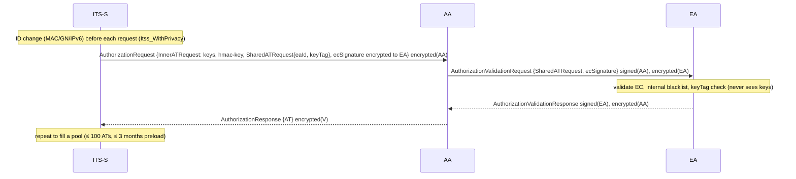

# 05 — Credential-management protocols as plug-ins

Status: design draft for review (2026-09-18). Interface summary in `03-interfaces.md` §7; node runtimes in `06-node-models.md`; revocation metrics in `08-measurement-and-data.md`.

Citation keys used below (full references in §9): [BRECHT] Brecht et al. 2018; [CAMP-EE] CAMP SCMS PoC EE Requirements, Release 1.1 (2016); [PRIMER] USDOT SCMS Technical Primer (2019); [WHYTE22] W. Whyte, IEEE 1609.2.1 status decks (2022); [TS102941] ETSI TS 102 941 V2.2.1; [TS102940] ETSI TS 102 940 V2.1.1; [TS103097] ETSI TS 103 097 V2.1.1; [TS103759] ETSI TS 103 759 V2.1.1; [TR103415] ETSI TR 103 415 V2.1.1; [EUCP] EU C-ITS Certificate Policy 1.1; [FIPS204] [FIPS205] [FIPS203]; [PQCLEAN]; [NDSS24] Twardokus et al. NDSS 2024; [ROSTAMI18]; [CGGMP21]; [RFC9591]; [TRACCOON]; [CELI25]; [QUORUS]; [KHODAEI18]; [BCAM17]; [ACPC].

## 1. Why one interface can hold SCMS, ETSI and threshold/PQ schemes

The three families differ in *what* is issued, *who* talks to whom, and *how* trust is withdrawn, but every one of them is expressible as: a set of **entities** with trust boundaries, a set of **credential types** with lifecycles, a set of **flows** (message sequences with per-step compute), a **signing policy** that binds message types to credentials and decides how the signer is identified on the air, a **revocation mechanism** that is active (a list that receivers must fetch and process), passive (the issuer stops issuing), or both, a **reporting format**, **trust-anchor** updates, a table of **primitives** with sizes and costs, and protocol-specific **metrics** and **attack hooks**. The interface (03-interfaces §7) is exactly that list. Section 6 proves the claim by sketching each family against every element, and §7 lists the invariants the engine enforces so that "the backend is not an oracle" holds for any implementation.

## 2. The interface in detail

### 2.1 Entities and trust boundaries

```rust
pub struct EntityRoleSpec {
    pub name: &'static str,                 // "RA", "PCA", "LA1", "EA", "AA", "TLM", "DKG-committee", …
    pub boundary: TrustBoundary,            // organisational separation class; the validator rejects a scenario that co-hosts roles the protocol declares must be separate
    pub central: Centrality,                // IntrinsicallyCentral | Central | Distributed { n, t }
    pub default_profile: HardwareProfileRef,// backend server profile (06-node-models §4)
    pub default_service: ServiceModelRef,   // M/M/c parameters, batching (06-node-models §4)
    pub storage_growth: Vec<StorageCounter>,// e.g. RA: enrollment certs + request hashes; PCA: (i,j,lv,cert) per issued cert [BRECHT Table II]
    pub availability: Option<AvailabilityModel>,
}
```

SCMS declares the mandatory separations of [BRECHT §X] (PCA ≠ RA; PCA ≠ LA; LA1 ≠ LA2; LOP ≠ RA/MA; MA ≠ RA/LA/PCA) as `boundary` constraints; the scenario validator refuses a topology that puts PCA and RA on one backend node unless `security.protocol.params.relax_separation: true` is set and recorded in the manifest.

### 2.2 Credential types and lifecycles

```rust
pub struct CredentialTypeSpec {
    pub name: &'static str,                 // "enrollment-cert", "pseudonym-cert", "authorization-ticket", "umbrella-credential", …
    pub encoded_bytes: fn(&PrimitiveSet, &EnvelopeProfile) -> u32,   // exact per primitive choice; asserted equal to the real encoder in `real` codec tier
    pub validity: ValidityPolicy,           // { period, overlap, concurrent_count, preload_horizon, start_alignment }
    pub lifecycle: Fsm<CredState>,          // Requested → Issued → Downloaded → Active → (Expired | Revoked | Starved)
    pub holder: HolderKind,                 // EndEntity | Entity(role)
}
```

Defaults that ship with the two reference protocols (all cited):

| Type | Period | Overlap | Concurrent | Preload | Source |
|---|---|---|---|---|---|
| SCMS pseudonym cert | 1 week (i-period 10,080 min) | 1 h (lifetime 10,140 min) | 20 minimum per week (j = 0..19); 60/week for NYC taxis | 1–3 years (3,120 certs for 3 years) | [CAMP-EE §2.1.5.3.2, §2.2.7.6.1, Table 2.1.2.6.2]; [BRECHT §II-C]; [PRIMER p.7] |
| SCMS enrollment cert | ≤ 7 years in CV pilots; design intent 30 years | — | 1 | — | [CAMP-EE Table 2.1.2.6.2]; [BCAM17 fn.5] |
| ETSI authorization ticket (AT) | ≤ 1 week | project-defined | ≤ 100 per vehicle (EU CP); C2C-CC profile 20 parallel | ≤ 3 months | [EUCP §7.2.1]; [TR103415 Table A.2] |
| ETSI enrolment credential (EC) | 3 years | — | 1 | — | [EUCP Table 11] |
| ETSI AA / EA / Root / TLM certs | AA 4/5 y, EA 2/5 y, Root 3/8 y, TLM 3/4 y (key usage / validity) | — | — | Root/TLM preloaded on ECTL 1–3 months ahead | [EUCP Table 11, §7.2] |

### 2.3 Flows as state machines over the modeled network

A `FlowSpec` is a named state machine whose transitions are `Action`s (03-interfaces §7): every `Send` is routed by the engine over `BackendNet`, `CellularUu`, `Backhaul` or the V2X air interface via an RSU proxy; every `Compute` is charged to the entity's `ServiceModel` and, for end entities, to the OBU's CPU/HSM servers; `StartTimer` implements batching windows and retry timers. The engine records each step on the `proto.msg` channel with `flow`, `step`, `bytes`, `transport`, so a sequence diagram can be regenerated from any run.

Multi-party interactive flows (DKG, t-of-n signing, share refresh) are ordinary flows whose participants are several entities; each round is one `Send` per pair or one broadcast over the backend network, and the round's compute is charged per participant. The engine has no shortcut for "the committee signs": the signature exists only when the last round's message has been delivered and processed.

### 2.4 Signing policy and signer identification

```rust
pub trait SigningPolicy {
    fn credential_for(&self, msg: MsgType, ee: &EeState) -> CredentialRef;     // which pseudonym/AT/umbrella credential signs this message now
    fn signer_id(&mut self, ctx: &mut dyn Ctx, ee: &EeState, msg: MsgType, rx_hint: &NeighborTable) -> SignerIdPolicy; // Digest | FullCert | Chain(n) | Fragment(k of n)
    fn change_trigger(&mut self, ctx: &mut dyn Ctx, ee: &EeState) -> Option<ChangeEvent>; // pseudonym change strategy hook
    fn p2pcd(&self) -> P2pcdPolicy;                                            // inline / out-of-band / none, thresholds
}
```

Reference defaults:

| Policy | Default | Source |
|---|---|---|
| SCMS/J2945-1 certificate attachment | full certificate at least every 450 ms (`CertAttachInt`), digest (HashedId8) otherwise | [ROSTAMI18 Table 1]; NDSS restates "every fifth SPDU" [NDSS24 §II-A] |
| ETSI CAM certificate attachment | digest by default; full AT once per second; immediately when a CAM from an unknown AT is received or an `inlineP2pcdRequest` names our AT | [TS103097 §7.1.1] |
| ETSI DENM | signer is always the certificate; `generationLocation` present | [TS103097 §7.1.2] |
| SCMS pseudonym change | every 5 min unless < 2 km since last change (J2945/1 `CERTCHG`); NYC pilot: 2 km or 5 min, whichever first | [PRIMER pp.7–8]; [BRECHT §II-A] |
| C2C-CC pseudonym change (BSP) | at ignition within 1 min (unless restart < 10 min), then random 10–30 min; lock ≤ 15 min (ETSI max lock 255 s) | [TR103415 Table A.2, §4.4.5] |
| C2C-CC newer strategy | ≥ 3 unlinkable segments per trip for ≥ 95 % of trips: change at trip start; next at random 800–1,500 m; further ≥ 800 m apart within 2–6 min | [TR103415 §4.2.3.2] |
| P2PCD | inline requests, response backoff uniform 0–250 ms, respond only if fewer than 3 responses heard | IEEE 1609.2a-2017 §8; [NDSS24 §II-A] |

### 2.5 Revocation mechanism

```rust
pub enum RevocationMechanism {
    Active(ActiveRevocation),      // a list is produced, signed, distributed, downloaded, processed, enforced
    Passive(PassiveRevocation),    // issuance stops; credentials expire; latency bounded by preload horizon
    Both(ActiveRevocation, PassiveRevocation),
}
pub struct ActiveRevocation {
    pub entry: EntryFormat,                     // LinkageSeeds { ls1, ls2, la_ids, i, jmax } | HashedId10 { id, expiry } | Custom { bytes }
    pub entry_bytes: u32,                       // e.g. 32 B of seeds + ~8 B framing ≈ 40 B/entry [BRECHT §VI-F]
    pub series: Vec<CrlSeries>,                 // 1 pseudonym, 2 SCMS components, 3 identification/RSE app, 4 enrollment; 256 root-managed [BRECHT §VI-G]
    pub cadence: CadencePolicy,                 // Daily | Weekly | Continuous | OnDecision — scenario-selectable, default daily [USDOT 2013 working assumption; BRECHT §VI-G]
    pub distribution: Vec<DistributionPath>,    // CrlStoreHttp (via RA/cellular), RsuBroadcast, Epidemic V2V
    pub receiver_processing: ProcessingCost,    // per entry per i-period: 2 SHA-256 + up to 2·jmax AES; storage per entry [ACPC §2; BRECHT §VII]
    pub enforcement: EnforcementRule,           // drop messages whose cert matches; stop transmitting if self is listed [CAMP-EE §2.2.10.2]
    pub stages: &'static [StageId],             // timestamps emitted: decision, issued, published, first_rsu_broadcast, downloaded(node), processed(node), enforced(node)
}
pub struct PassiveRevocation { pub blocklist_at: EntityRole /* RA or EA */, pub effect: StarvationEffect /* refuse top-up / refuse AT validation */, pub stages: &'static [StageId] /* decision, blocklisted, last_valid_credential_expiry(node) */ }
```

The two latency definitions the brief asks for are therefore explicit: active revocation latency is measured to `enforced(node)` for each node and summarised as "time until 95 % of nodes enforce"; passive revocation latency is measured to `last_valid_credential_expiry(node)`, bounded by preload horizon plus credential validity (ETSI: ≤ 3 months + 1 week [EUCP §7.2.1]; C2C-CC tank 3 years [TR103415 Table A.2]). Both are emitted on the `proto.revocation` channel with the stage id, so 08-measurement §2.9 computes them identically for any protocol.

### 2.6 Reporting format, trust anchors, primitives, metrics, attack hooks

- `ReportingFormat`: structure (TS 103 759 `EtsiTs103759Data` with observations by target, V2X PDU evidence and the reporter's AT [TS103759 §4–7]; 1609.2.1 upload interface with encrypted encapsulation [WHYTE22]), encoded size function, transport (store-and-forward to RA/LOP or EA; RA shuffle threshold 10,000 reports or 1 day in the PoC [CAMP-EE SCMS-765]), budgets (creation/storage/transmission per TS 103 759 §5.1; EE may delete unsent reports older than 1 week [CAMP-EE §2.2.8]).
- `TrustAnchorPolicy`: SCMS: Global Policy File and Global Certificate Chain File signed by the Policy Generator, elector-endorsed root management [BRECHT §II-B]; ETSI: ECTL (TLM) with full+delta lists, RCA CTL and CA-CRL via Distribution Centre, RSU broadcast of delta CTL over single-hop GeoNetworking without segmentation [TS102941 §6.3, Annex D.3]; update cadence ≤ 3 months, stations updated within 1 week [EUCP §2.2].
- `primitives()`: the protocol's `PrimitiveDescriptor` set (04-models §9.4 holds the tables; §5 below summarises sizes).
- `metrics()`: protocol-specific providers, e.g., SCMS `crl.entries`, `crl.bytes`, `crl.expansion_cost_per_node`, `topup.bytes`, `ra.batch_latency`; ETSI `at.pool_level`, `ectl.age`, `ec.blocklisted`; threshold `dkg.rounds`, `sign.rounds`, `sign.bytes_per_signer`, `share_refresh.duration`.
- `attack_hooks()`: named points an `Attacker` may bind to: `before_sign(msg)`, `credential_choice`, `report_submit`, `crl_observe`, `rsu_broadcast(crl|ctl)`, `topup_request`, `committee_member(role)` (for compromised-participant attacks in threshold schemes).

## 3. US SCMS sketch (CAMP PoC / IEEE 1609.2.1)

### 3.1 Entities

Root CA, ICA, ECA, DCM, RA, PCA (ACA in 1609.2.1), LA1, LA2, MA (with CRLG and global detection), PG, LOP, CRL Store, CRL Broadcast (RSE/satellite), Distribution Centre, Electors, optional Certificate Access Manager [BRECHT §II-B; WHYTE22]. In the engine: Root CA and Electors are offline (no network node); the rest are `NodeId`s on the backend network with the service models of 06-node-models §4. Storage counters follow [BRECHT Table II]: RA stores enrollment cert and request hashes; PCA stores encrypted PLVs, (i, j), lv, certificate, request hash; LA stores initial seeds and pre-linkage values.

### 3.2 Flows (message sequences over the modeled network)

Bootstrap (offline in the PoC; modeled as a scenario-time-zero event): device → DCM → ECA → device receives enrollment cert, ECA/RA certs, elector/root/PCA/MA/PG/CRLG certificates and CRL Store contact [BRECHT §V-A; CAMP-EE §2.2.6.2].

Pseudonym provisioning [BRECHT §V-E, Fig. 5; CAMP-EE §2.2.7.6–7.8]:

```mermaid
sequenceDiagram
  participant EE as OBU
  participant LOP
  participant RA
  participant LA1
  participant LA2
  participant PCA
  EE->>LOP: CertProvisioningRequest {enrollment cert, A, H, f_k, f_e, time, start} signed(EC), encrypted(RA)   [Uu or RSU backhaul]
  LOP->>RA: same, IP/MAC stripped
  RA-->>EE: RequestAck {hash8(request), first-batch time, repo URL}
  Note over RA: verify EC, blacklist check, one request per period; butterfly expansion B_ι, J_ι for all (i,j)
  RA->>LA1: pre-linkage values for LCI1 (encrypted to PCA)
  RA->>LA2: pre-linkage values for LCI2 (encrypted to PCA)
  Note over RA: shuffle ≥ 10,000 requests or 1 day, then one request per certificate
  RA->>PCA: {tbs cert with B_ι, J_ι, enc(plv1), enc(plv2), hash}
  Note over PCA: lv = plv1 ⊕ plv2, random c_ι, B_ι + c_ι·G, ECQV implicit sign, encrypt to J_ι, sign packet
  PCA-->>RA: encrypted cert + reconstruction value
  Note over RA: batch one i-period per zip; store in per-device repo
  EE->>RA: download LPF, LCCF, then X_Y.zip batches, then X.info (next batch time)
  Note over EE: derive b'_ι = a + f_k(ι) + c_ι; store certs and keys
```

Engine costs on this flow: the OBU pays one ECDSA sign + ECIES encryption for the request and one ECQV reconstruction per certificate on download; RA pays one signature verification, 2·(certificates) butterfly expansions (one EC scalar multiplication and one addition each), shuffling as a batching delay; LA pays one AES per pre-linkage value plus a hash per period; PCA pays one ECIES decryption of two PLVs, one ECQV issuance (scalar multiplication), one ECIES encryption and one ECDSA signature per certificate. Bytes: request ≈ 2 EC points + 2 AES keys + enrollment cert + envelope (≈ 300–400 B, derived from §5 sizes); each batch ≈ 20 × (cert ≈ 80–120 B + encrypted wrapper) [R5 §E.1 derived]; the 3-year initial download ≈ 312–468 KB of certificate bytes plus wrappers (derived, marked `TODO: calibrate` against a real batch).

Top-up: RA pre-generates up to 3 years ahead and adds a week every week; EE downloads incrementally when connected, waiting for the `.info` timestamp [PRIMER pp.5,7; CAMP-EE §2.2.7.7.7, §2.2.7.8.8; WHYTE22 p.11]. Modeled as a periodic EE flow `topup` with parameters `download_horizon_weeks` (default 4, `TODO: calibrate`: OEM-configured per [PRIMER]) and `connect_policy` (on RSU contact, on cellular coverage, or fixed interval).

Misbehavior report [CAMP-EE §2.2.8; BRECHT §VI-A; TS103759 for the payload]: EE signs with a pseudonym cert, encrypts to MA, submits to RA via LOP when in range of an RSU or on cellular; RA shuffles (10,000 or 1 day) and forwards individually to MA. Store-and-forward on the OBU with a `report_outbox` and the 1-week deletion rule.

Investigation [BRECHT §VI-C, Fig. 6]: MA → PCA: lv → encrypted (plv1, plv2); MA → LA1 or LA2: "same device?" → boolean. Revocation [BRECHT §VI-D]: MA → PCA: lv → request hash + RA host; MA → RA: hash → RA blacklists the enrollment cert (passive component) and returns LA hosts and LCIs; MA → LA1, LA2: LCI → ls_x(i) for the current period; CRLG appends {ls1(i), ls2(i), la ids, i} to CRL series 1, signs, publishes to the CRL Store and CRL Broadcast. The legacy `resolve_and_revoke` steps map one-to-one onto these messages (01-inventory §3.3), now with real hops.

CRL distribution and OBU processing [PRIMER p.7; BRECHT §II-B, §VII; CAMP-EE §2.2.9–2.2.10]: OBUs fetch the composite CRL file on every RA connection (HTTP GET, no EE authentication), from RSU broadcast, or by epidemic V2V exchange (scenario option, modeled as a message type with GN/WSMP framing). On receipt the OBU verifies the CRLG signature, then for each entry forwards both seed chains to the current i-period (2 SHA-256 per entry per period), enumerates 2·jmax AES to compute the period's linkage values, and marks matching certificates; before each period boundary it precomputes the next period [ACPC §2; BRECHT §VII]. Storage: 10,000 entries ≈ 400 KB (≈ 40 B/entry) [BRECHT §VI-F]. If the OBU finds itself listed it stops transmitting [CAMP-EE §2.2.10.2 step 8.4].

### 3.3 Sketch against the interface

| Interface element | SCMS binding |
|---|---|
| Roles | 13 online roles + 2 offline; separations per [BRECHT §X] |
| Credential types | enrollment cert (explicit), pseudonym cert (implicit ECQV, `linkageData` id with i and lv), identification/application certs, CA certs, CRLG/PG/MA certs |
| Flows | bootstrap, provisioning, top-up, report, investigation, revocation, CRL distribution, policy-file update |
| Signing policy | J2945/1 attachment (450 ms), P2PCD inline; change strategy 5 min / 2 km |
| Revocation | `Both`: active linkage-seed CRL (series 1, daily default, RSU + cellular + optional epidemic) and passive RA blacklist |
| Reporting | TS 103 759 payload in 1609.2.1 encrypted upload |
| Trust anchors | GPF/GCCF via PG, elector-managed root CTL |
| Primitives | ECDSA-P256 (SHA-256), ECQV-P256, AES-128 (butterfly, linkage), ECIES; optional PQ variants via §5 tables |
| Metrics | CRL size/entries/download/processing; top-up bytes; RA batch latency; residual harm |
| Attack hooks | credential choice (Sybil across 20 concurrent certs), CRL observe (evasive dormancy), RSU CRL broadcast (fake CRL), report submit (poisoning) |

Ported legacy code: `linkage.py` and `butterfly.py` become the SCMS plug-in's LA and RA/PCA arithmetic; the legacy 2-LA resolution and CRL entry structure are unchanged; the CRL processing cost model above is new.

## 4. ETSI ITS PKI sketch (TS 102 940 / TS 102 941 / TS 103 097 / TS 103 759)

### 4.1 Entities

Policy Authority (offline), TLM, CPOC, Root CA, EA, AA, optional Distribution Centre, Misbehaviour Authority with optional pre-processing, manufacturer SOC interface [TS102940 Table 8–9, §7.6; TS103759 §4.1]. Transport is HTTP over TCP/IP without TLS; security is in the TS 103 097 envelopes [TS102941 §6.2.2]. Connectivity options include ITS-G5 via RSU, WLAN, cellular, EV charger, OBD at a garage [TS102941 §6.2.2].

### 4.2 Flows

Enrolment (S3): ITS-S builds `InnerECRequest` with a fresh verification key, proof-of-possession inner signature, outer signature with the canonical key (or current EC on re-enrolment), encrypts to EA; EA answers with the EC [TS102941 §6.2.3.2].

Authorization, standard variant (S2, S4):


[TS102941 §6.2.3.3–6.2.3.4, §6.1.4 NOTE 1; EUCP §7.2.1]

Authorization with butterfly keys (S3/S4, "based on IEEE 1609.2.1"): one `ButterflyAuthorizationRequest` with a new caterpillar pair; EA returns `currentI`, `requestHash`, `nextDlTime`; EA expands and sends multiple `ButterflyCertRequest`s to the AA; AA returns encrypted ATs; ITS-S downloads batches with `ButterflyAtDownloadRequest`, authorised by the EA's internal blocklist or an OAuth token [TS102941 §6.2.3.5, Fig. 23]. Both variants share the SCMS butterfly arithmetic, so the same ported code serves both protocols.

Trust lists: TLM signs the ECTL (full + delta, `ctlSequence`, `nextUpdate`), Root CA signs its CTL and the CA-only CRL; distribution via CPOC/DC over HTTP and via RSU broadcast (delta CTL only, single-hop, no segmentation, stations re-broadcast unmodified) [TS102941 §6.3.1–6.3.5, Annex D.3]. There is no per-vehicle CRL: "revocation of authorization tickets is not possible as passive revocation is preferred" [TS102941 §6.1.4 NOTE 4].

Misbehaviour reporting [TS103759 §4–7]: local detectors (classes 1–5) → event categorisation → report decision under budgets → `EtsiTs103759Data` signed with the AT, encrypted to the MA, stored and sent when connectivity exists → optional pre-processing → MA collection/investigation/response → EA/AA actions (no action, alert, block EC). Evidence must include the original received messages with their AT so the MA can re-verify [TS103759 §4.2.4].

Passive revocation: the EA rejects all subsequent AT requests for the blocked ITS-S; the EC internal blacklist is never published [TS102941 §6.1.6; EUCP §7.3.2]. The vehicle keeps transmitting until its AT pool is exhausted; with preload ≤ 3 months and AT validity ≤ 1 week the worst-case eviction lag is the preload horizon [EUCP §7.2.1].

### 4.3 Sketch against the interface

| Interface element | ETSI binding |
|---|---|
| Roles | PA (offline), TLM, CPOC, RCA, EA, AA, DC, MA, pre-processing |
| Credential types | EC (explicit, 3 y), AT (implicit or explicit, ≤ 1 week, ≤ 100 concurrent, ≤ 3 months preload), CA certs, TLM cert, link certs |
| Flows | enrolment, re-enrolment, authorization (standard, butterfly), AT download, ECTL/CTL/CRL update (HTTP and RSU delta broadcast), misbehaviour report |
| Signing policy | TS 103 097 §7.1.1 CAM rule (digest; AT once per second; immediate on unknown AT or inline request); DENM always certificate; C2C-CC change strategies |
| Revocation | `Passive` for vehicles (EA blocklist); `Active` CA-CRL only (series: CA certificates) |
| Reporting | TS 103 759 native |
| Trust anchors | ECTL (TLM), RCA CTL, CA-CRL; ≤ 3-month cadence; RSU delta broadcast |
| Primitives | ECDSA-P256 / brainpoolP256r1 / P-384 (TS 103 097); ECIES; optional PQ |
| Metrics | AT pool level, ECTL age, time-to-starvation, CTL bytes over RSU |
| Attack hooks | AT choice (Sybil across ≤ 100 ATs, or 20 under C2C-CC), report submit, RSU CTL broadcast (fake CTL), AA/EA outage |

## 5. Threshold, umbrella-threshold and post-quantum family

The user's own specifications are pending (`[FILL IN]` in the brief §8.3). What follows is the interface-level commitment plus cited building blocks, so the plug-in can be written once the spec arrives without changing the engine.

### 5.1 What the interface guarantees

| Requirement (brief §8.3) | Mechanism |
|---|---|
| Multi-party interactive protocols with real round trips | `FlowSpec` with `Centrality::Distributed { n, t }` roles; each round is a `Send` per pair or broadcast over `BackendNet`; compute charged per participant per round; a round completes only when all required messages are delivered, so WAN latency and entity outages shape the signature latency directly |
| Variable and large key, signature, certificate sizes | `PrimitiveDescriptor.sig_bytes: Fixed | Variable {mean, max}`; `CredentialTypeSpec.encoded_bytes` is a function of the primitive set; the air-interface layer fragments per `Fragmenter` (04-models §7.3) and reports reassembly failure; `SecuredPdu` sizes are exact |
| Multiple signature verifications per message | `VerifyPlan` is a list of primitive operations (e.g., hybrid: ECDSA + ML-DSA; umbrella: credential signature + delegation signature); the node runtime charges each op to CPU or HSM per the cost table and the verification policy may skip lower-priority ops |
| Hierarchical or umbrella credentials covering many pseudonyms | `CredentialTypeSpec` with `holder: EndEntity` and `covers: Vec<CredentialTypeRef>`; the signing policy chooses the leaf pseudonym and the envelope's `SignerIdPolicy::Chain(n)` decides whether the umbrella certificate (or its digest) travels with the message; the peer certificate cache stores the umbrella once |
| PQ primitives with sizes and costs from specifications and benchmarks | tables in §5.3 and 04-models §9.4; `CryptoBackend::Real` binds to liboqs (MIT) through the `pqcrypto`/`oqs-sys` crates (MIT/Apache-2.0) [R5 §D] |
| Revocation semantics that differ from CRLs | `RevocationMechanism::Custom` is not offered; instead `Active`/`Passive`/`Both` with `EntryFormat::Custom { bytes }` and protocol-supplied `receiver_processing` cost, so a share-revocation or umbrella-revocation list still reports the same stage timestamps |

### 5.2 Building blocks with cited round counts and sizes

| Block | Rounds | Bytes | Source |
|---|---|---|---|
| Threshold ECDSA key generation (CGGMP21) | 3 | n × 4κ incoming per party (κ = 256 bit) | [CGGMP21 Table 1] |
| Threshold ECDSA key refresh (CGGMP21) | 3 | n × (2nκ + (2m+5)ν) incoming (ν = 2048-bit Paillier) | [CGGMP21 Table 1, §1.1] |
| Threshold ECDSA signing, interactive (CGGMP21) | 3 | ≈ 15 KiB pairwise (65κ + 50ν) | [CGGMP21 Fig. 1] |
| Threshold ECDSA signing, non-interactive (CGGMP21) | 3 presign + 1 online | presign n × (65κ + 48ν); online n × κ | [CGGMP21 Table 1] |
| GG18 signing | 9 rounds | 2,328 + 5,024·t bytes per player | [GG18 §7; GG20 §6] |
| FROST (Schnorr/Ed25519/P-256) | 2 (or 1 with preprocessing) | round 1: 64–66 B; round 2: 32 B; coordinator required | [RFC9591 §5] |
| Proactive share refresh (Herzberg et al.) | 1 private message to each other party + 1 broadcast | share-sized | [HJKY95] |
| Threshold Raccoon (lattice) | 3 | sig ≈ 13 KiB, vk ≈ 4 KiB, ≈ 40 KiB per signer per signature; verify 0.23 ms | [TRACCOON] |
| Threshold ML-DSA, ≤ 6 parties, FIPS-204-verifiable | 3 per attempt (≈ 4–5 attempts expected) | 10.5–525 kB per run | [CELI25]; attempts per [QUORUS §5] |
| Quorus threshold ML-DSA (any n) | 19–149 online rounds | 2.2–14.5 MB per party per signature | [QUORUS Tables 3–5] |
| TALUS threshold ML-DSA | 1 (TEE) or 2 (MPC) online rounds | stock FIPS 204 signature output | [TALUS §1, §7] |

### 5.3 Primitive sizes (bytes) and cost anchors

| Primitive | pk | sig | Verify cost anchors | Source |
|---|---|---|---|---|
| ECDSA P-256 | 33 (compressed) | 64 (66 in 1609.2 COER) | 2,000/s hardware (NXP SAF5400; CRATON; SLI97), 1,550/s OpenSSL on Cortex-A72, 14,933/s wolfSSL on Cortex-A76, 976 k cycles on Cortex-M4 | [R5 §A.1, §B.5, §C] |
| ECQV implicit cert (P-256) | reconstruction value 33 | — (cert ≈ 80–120 B) | one scalar multiplication to reconstruct | [SEC 4 §3.4; R5 §A.1] |
| ML-DSA-44 / -65 / -87 | 1,312 / 1,952 / 2,592 | 2,420 / 3,309 / 4,627 | 3,214/s (Pi 4), 8,139/s (Pi 5) for -44; Cohda MK6 Dilithium verify 0.189 ms; M4: 1.42 M / 2.42 M / 4.19 M cycles | [FIPS204 Table 2]; [R5 §B.2, §B.3]; [NDSS24 Table V] |
| Falcon-512 / -1024 (padded) | 897 / 1,793 | 666 / 1,280 | 7,866/s (Pi 4), 19,831/s (Pi 5); MK6 0.446 ms; M4 504 k cycles | [PQCLEAN api.h]; [R5 §B] |
| SLH-DSA-SHA2/SHAKE-128s / 128f | 32 / 32 | 7,856 / 17,088 | MK6 SPHINCS+ verify 5.436 ms; M4 7.5 M / 21.9 M cycles | [FIPS205 Table 2]; [NDSS24]; pqm4 |
| ML-KEM-512/768/1024 (backend encryption) | ek 800/1,184/1,568; ct 768/1,088/1,568 | — | — | [FIPS203 Table 3] |
| Hybrid ML-DSA-44 + ECDSA-P256 (raw concat) | 1,345 | 2,484 | sum of components | derived |

Air-interface consequence (04-models §7.3 develops the fragmentation strategies): a signed BSM with an explicit ECDSA certificate is ≈ 330 B, Falcon-512 ≈ 2,435 B and ML-DSA-44 ≈ 6,310 B frame size, against an 802.11 MSDU cap of 2,304 B and a practical 10 MHz C-V2X transport block of 437 B at the MCS used in [NDSS24 §III]; the Partially-Hybrid design fragments the hybrid certificate across the first α SPDUs of each 500 ms cycle [NDSS24 §IV].

### 5.4 Sketch against the interface (umbrella-threshold-PQ placeholder)

| Interface element | Placeholder binding (to be replaced by the user's spec) |
|---|---|
| Roles | issuing committee `n` of which `t+1` sign (Distributed), coordinator, RA-like registration front end, MA, revocation publisher |
| Credential types | umbrella credential (long-lived, PQ-signed, covers `k` leaf pseudonyms), leaf pseudonym (short-lived, derived), committee share (refreshable) |
| Flows | DKG (3 rounds), share refresh per epoch (3 rounds), umbrella issuance (t-of-n signing over WAN), leaf derivation (local or 1 round), revocation of an umbrella (list entry or share-based) |
| Signing policy | message signed with leaf key; envelope carries leaf digest, umbrella digest, or fragments of the umbrella cert on a cycle |
| Revocation | `Active` with `EntryFormat::Custom` (umbrella id + epoch) and protocol-supplied receiver cost; optional `Passive` (committee refuses renewal) |
| Reporting | TS 103 759 payload reused |
| Trust anchors | committee public key set with epoch number; rollover as a flow |
| Primitives | ML-DSA-65 or Falcon-512 leaf signatures; threshold ML-DSA or Threshold Raccoon at the committee; hybrid option |
| Metrics | rounds and bytes per issuance, issuance latency vs WAN RTT, verify ops per message, fragmentation loss, CRL bytes per revoked umbrella |
| Attack hooks | compromised committee member (≤ t), oversized-message flooding against the verification budget, umbrella misuse across regions |

## 6. Crypto modes and the equivalence guarantee

- `Modeled`: keys are opaque handles; a `SigToken` is `{key id, message hash}`; `verify` returns true iff the token's key matches the claimed signer's public handle and the message hash matches, and the signer's credential passes the same policy checks as in real mode. Costs come from the primitive's cost table for the node's hardware profile; sizes from the descriptor.
- `Real`: real keys and signatures (RustCrypto `p256`, `pqcrypto`/liboqs, ECQV via the `ecqv` crate or an in-tree port of SEC 4 §3), real ASN.1 COER envelopes; the encoder asserts that the real size equals the descriptor size, otherwise the run aborts with a size-model defect report.
- Guarantee I-S1 (03-interfaces §6): the event log is identical between modes except the manifest's `crypto_mode`. Attacks that "forge" signatures are modeled as tokens with a wrong key id in both modes (a real attacker cannot forge either), so no outcome depends on cryptographic randomness.
- Test: the Phase 2 scenario runs in both modes in CI and the digests must match.

## 7. Invariants enforced on every protocol plug-in

I-P1 no direct entity-to-entity calls (every message crosses a modeled link with bytes); I-P2 every compute step is charged; I-P3 signer choice per message type is declared; I-P4 revocation stage timestamps are emitted; I-P5 end entities never read backend state except through received messages; I-P6 the protocol declares which credential fields are privacy-relevant (linkage value, AT digest) so the privacy metrics (07-threats §6) can be computed generically; I-P7 the plug-in's model card cites the standard clause for every default in §2–§4 or marks it `TODO: calibrate`.

## 8. Revocation latency decomposition (what every protocol reports)

| Stage id | SCMS | ETSI | Threshold placeholder |
|---|---|---|---|
| `detect(node)` | local detector fires | same | same |
| `report_sent(node)` | outbox → RA/LOP when connected | outbox → EA/MA path | same |
| `report_received(MA)` | after RA shuffle (10,000 or 1 day) | after optional pre-processing | same |
| `decision(MA)` | pipeline decision | same | same |
| `resolved(MA)` | PCA + LA round trips | EA lookup | committee lookup |
| `issued` | CRLG signs CRL | EA blocklist entry | revocation list signed by committee (t-of-n rounds) |
| `published` | CRL Store / RSU broadcast | (none for vehicles) | list published |
| `downloaded(node)` | per OBU | — | per OBU |
| `processed(node)` | per OBU after expansion cost | — | per OBU |
| `enforced(node)` | per OBU | `last_valid_credential_expiry(node)` | per OBU |
| `residual_harm` | messages from the revoked device still accepted by any node after `decision` | same | same |

## 9. References

- [BRECHT] B. Brecht et al., "A Security Credential Management System for V2X Communications," IEEE T-ITS 2018, arXiv:1802.05323.
- [CAMP-EE] CAMP VSC5, "SCMS PoC Implementation — EE Requirements and Specifications Supporting SCMS Software Release 1.1," 2016-05-04.
- [PRIMER] USDOT ITS-JPO, "SCMS Technical Primer," FHWA-JPO-19-775, 2019.
- [WHYTE22] W. Whyte, "V2X Certificate Management with IEEE 1609.2.1: Status and Deployment," 2022-01-20 and 2022-08-31 decks.
- [TS102941] ETSI TS 102 941 V2.2.1 (2022-11). [TS102940] ETSI TS 102 940 V2.1.1 (2021-07). [TS103097] ETSI TS 103 097 V2.1.1 (2021-10). [TS103759] ETSI TS 103 759 V2.1.1 (2023-01). [TR103415] ETSI TR 103 415 V2.1.1 (2025-03).
- [EUCP] European Commission, "Certificate Policy for Deployment and Operation of European C-ITS," Release 1.1, 2018-06.
- [FIPS203]/[FIPS204]/[FIPS205] NIST, 2024-08-13. [PQCLEAN] PQClean `api.h` headers (fetched 2026-09-17).
- [NDSS24] G. Twardokus, N. Bindel, H. Rahbari, S. McCarthy, "When Cryptography Needs a Hand: Practical Post-Quantum Authentication for V2V Communications," NDSS 2024.
- [ROSTAMI18] A. Rostami, H. Krishnan, M. Gruteser, "V2V Safety Communication Scalability Based on the SAE J2945/1 Standard," 2018.
- [CGGMP21] Canetti, Gennaro, Goldfeder, Makriyannis, Peled, ePrint 2021/060 (2024 rev.). [GG18] ePrint 2019/114. [GG20] ePrint 2020/540. [RFC9591] FROST, 2024. [HJKY95] Herzberg et al., CRYPTO 1995.
- [TRACCOON] del Pino et al., EUROCRYPT 2024, ePrint 2024/184. [CELI25] Celi et al., "Efficient Threshold ML-DSA up to 6 parties," 2025. [QUORUS] Bienstock et al., ePrint 2025/1163. [TALUS] Kao & Chang, arXiv:2603.22109.
- [KHODAEI18] Khodaei & Papadimitratos, ACM WiSec 2018, arXiv:1807.02706. [BCAM17] Kumar, Petit, Whyte, ACM WiSec 2017, ePrint 2017/744. [ACPC] Simplicio et al., ePrint 2018/324.
- SEC 4 v1.0 (ECQV), Certicom 2013. IEEE 1609.2a-2017 (ETSI docbox copy) for P2PCD and HashedId rules.
